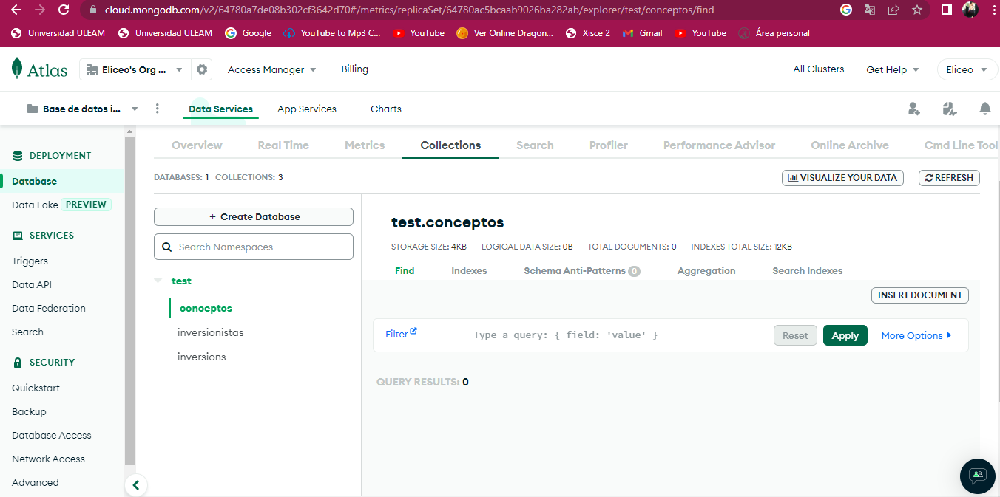
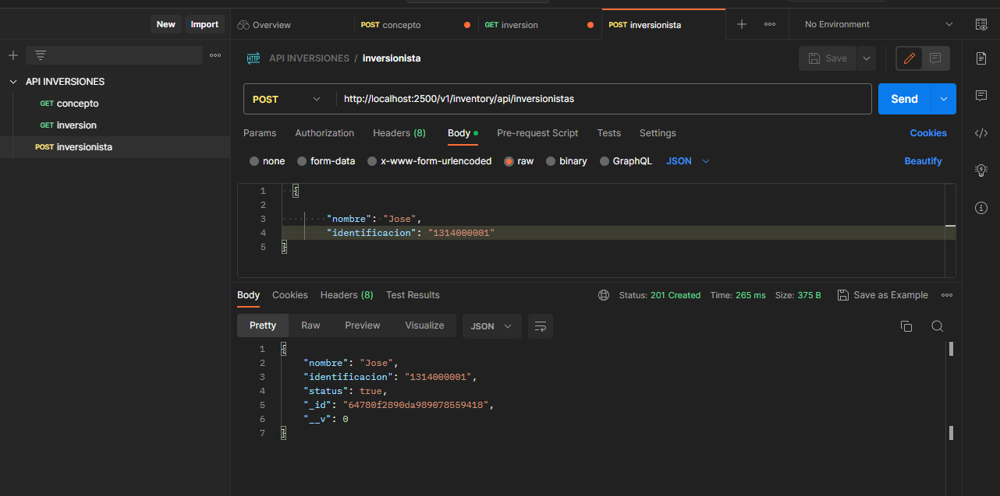
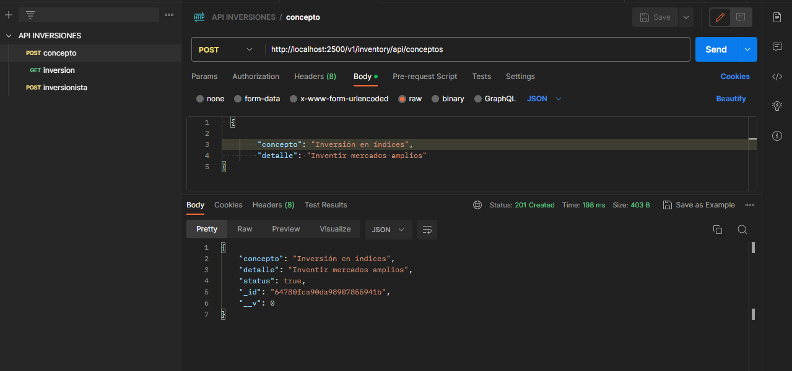
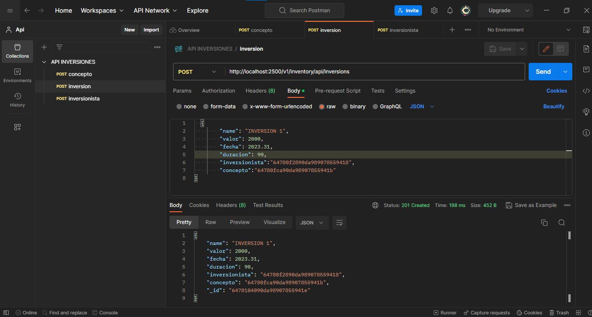
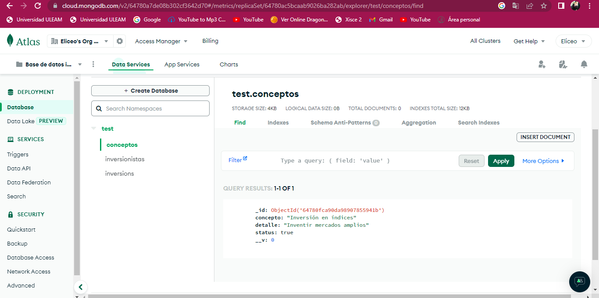
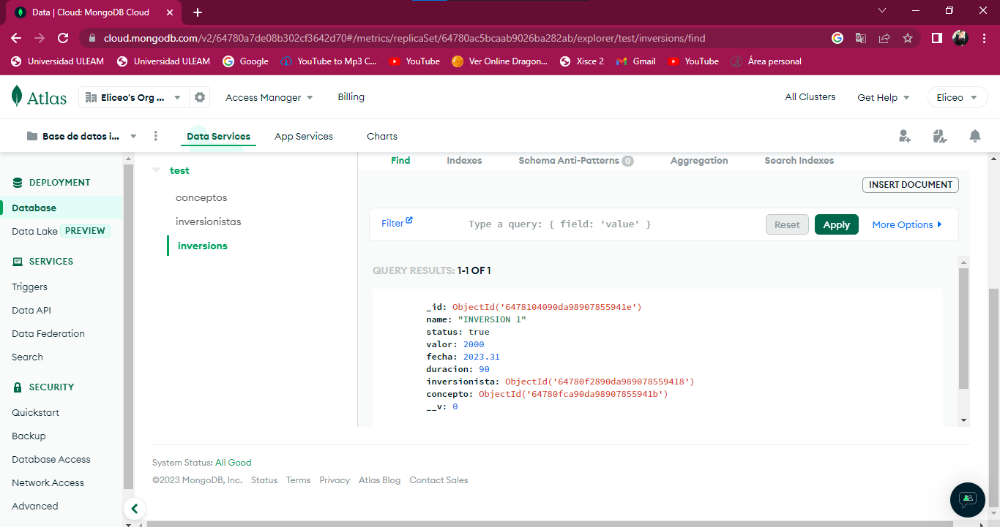
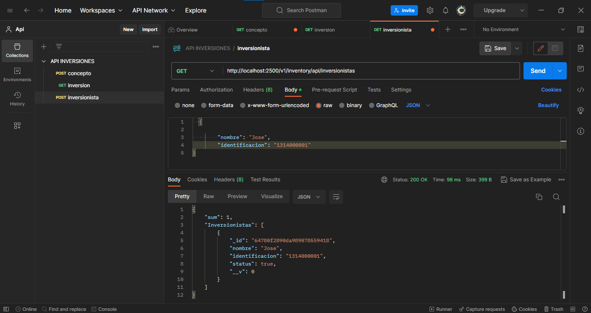
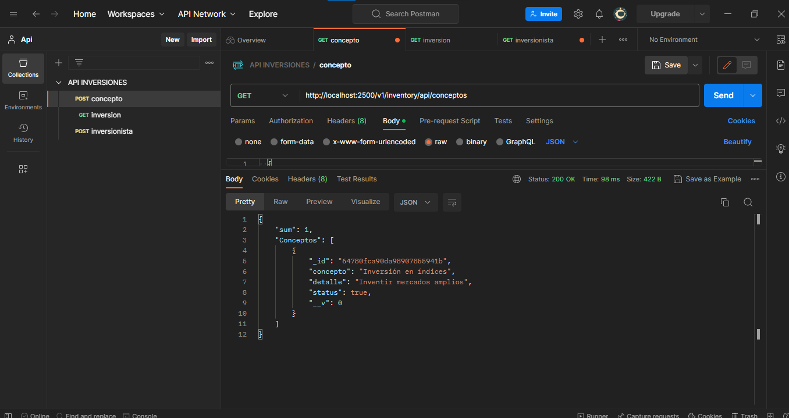
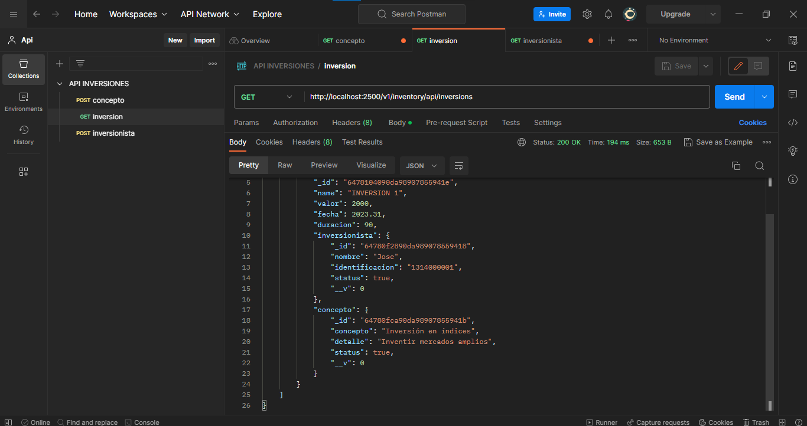

# TALLER 1 API REST CON MONGO ATLAS

# comando para ejecutar 

```
npm start
```

# SCHEMAS EN MONGO ATLAS




# POSTMAN

# POSTMAN GUARDAR INVERSIONISTA



# POSTMAN GUARDAR CONCEPTO




# POSTMAN GUARDAR INVERSION



# EVIDENCIA DE DATOS GUARDADOS MONGO ATLAS 







# EVIDENCIA DE GET POSTMAN  





## CONSULTADOS DATOS MEDIANTE ENLACE CON POPULATE





