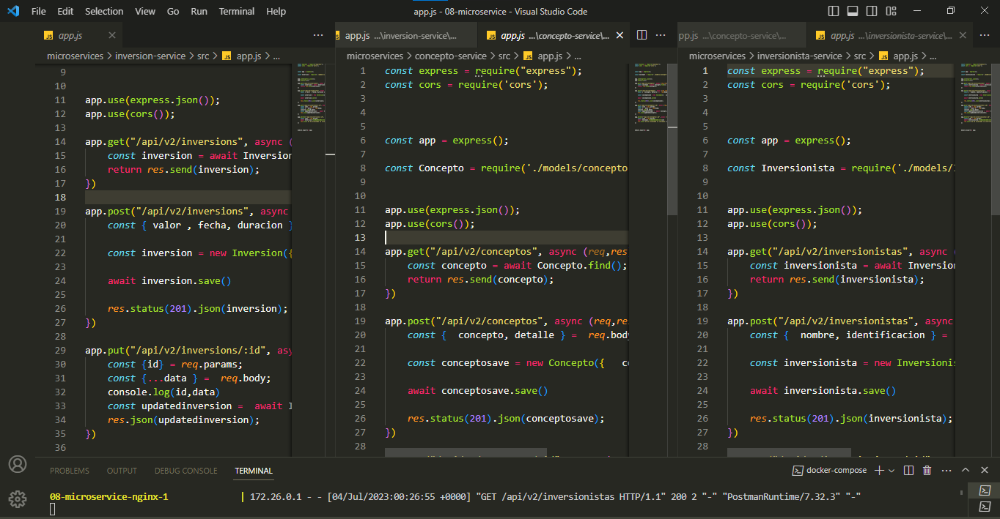

# PRÁCTICA 3

## Explicacion de docker-compose 

## para levantar el archivo de docker solo es necesario escribir el comando "docker-compose up", en este 
## se define cada servicio y sus respectivo puertos y base de datos, y en cada microservicio se encuentra un dockerfile referenciado con un build

# 1. Desglosar su servicio monolítico en 3 microservicios 

## Se evidencia los contenedores en docker

## evidencia de microservicios

## Evidencia desde postman por cada microservicios, en orden de POST, GET, Y BASE DE DATOS

### INVERSIONISTAS

### CONCEPTOS

### INVERSIONES

### EVIDENCIA DEL NGINX.CONF

